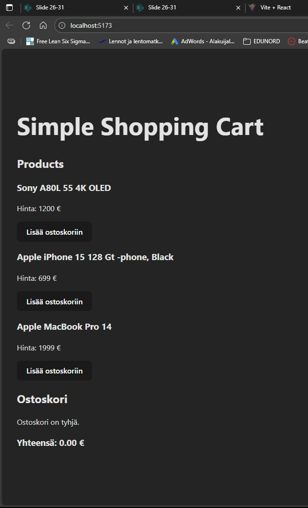

# my-shopping-cart

EduNord assignment

# 🛒 My Shopping Cart

This is a school project where I am building a simple "shopping cart" web application to learn the basics of version control, project structure, and frontend/backend workflow. The project is built from scratch and follows a clear step-by-step development process.

---

## 👨‍🎓 Project Background

As a student, I started this project locally to understand how real-world development workflows function — from local setup to GitHub integration. The primary goal is to learn the fundamentals of:

- Project initialization
- Git and GitHub workflow
- Markdown documentation
- Code structure and commits

---

## ✅ What I've Done So Far

### 🔹 Local Setup

- Created a project folder: `my-shopping-cart`
- Initialized Git locally using `git init -b main`
- Created an initial `README.md` file with `New-Item` in PowerShell
- Wrote and staged initial content with `git add .`
- Committed the first version: `git commit -m "Initial commit"`

### 🔹 GitHub Integration

- Created an **empty** GitHub repository (no README/gitignore)
- Connected the local repo using:
  ```bash
  git remote add origin https://github.com/ArcticCoderGuy/my-shopping-cart.git
  ```

my-shopping-cart/
├── src/
│ ├── main.jsx
│ ├── App.jsx
│ └── Components/
│ ├── Product.jsx
│ ├── ProductList.jsx
│ └── ShoppingCart.jsx

Starting to do Vite from here

---

---

## 🔁 Reflektio: Vaiheet 1–5 tehtynä

### ✅ Vaihe 1: Projektin alustus Vite-komennolla

Projektin moderni alustus tehtiin komennolla:

```bash
npm create vite@latest my-shopping-cart -- --template react

✅ Vaihe 2: Asennukset ja käynnistys
Siirryin oikeaan kansioon ja ajoin:

npm install
npm run dev


✅ Vaihe 3: Kansiorakenteen korjaus

Huomasin että projektikansio oli luotu sisäkkäin: my-shopping-cart/my-shopping-cart. Opin käyttämään PowerShell-komentoja (Move-Item, Remove-Item) ja sain selkeytettyä rakenteen siistiksi ja yksitasoiseksi. Tämä vahvisti ymmärrystä siitä, miten kansiorakennetta hallitaan komentorivillä.

✅ Vaihe 4: Komponenttien valmistelu
Loin src/Components/-kansion ja tiedostot:

Product.jsx

ProductList.jsx

ShoppingCart.jsx

Aloitin Product.jsx:n toteutuksen ja opin, miten propsit toimivat React-komponentin sisällä, ja miten niitä voi käyttää esimerkiksi tuotetietojen näyttämiseen ja napin klikkauksen käsittelemiseen.

✅ Vaihe 5: Projekti on nyt siisti ja toimiva
Nyt projektirakenne on kunnossa, Vite toimii, komponentteja aletaan rakentaa vaiheittain, ja kehitystyö voi jatkua loogisesti. Tärkein oppi tässä vaiheessa oli versiohallinnan, komentorivin ja komponenttiajattelun yhdistäminen käytännössä.

PS C:\Users\HP\Dev\my-shopping-cart> npm run dev

> my-shopping-cart@0.0.0 dev
> vite

13.38.47 [vite] (client) Re-optimizing dependencies because vite config has changed

  VITE v7.0.6  ready in 2054 ms

  ➜  Local:   http://localhost:5173/
  ➜  Network: use --host to expose
  ➜  press h + enter to show help


---

## 🛠️ To-Do: Vaiheet 6–10 – Komponenttien rakentaminen ja yhdistäminen

### 🔁 Edistyvä kehityslista

- [OK] **6. Toteuta `ProductList.jsx`**
  - Luo array tuotteista (id, name, price)
  - Käytä `map()` listan renderöintiin
  - Käytä `Product`-komponenttia ja anna propsit: `product`, `onAddToCart`

- [OK] **7. Muokkaa `App.jsx` hallitsemaan tilaa**
  - Lisää ostoskorin tila: `cartItems`, `setCartItems`
  - Lisää `addToCart(product)` ja `removeFromCart(productId)`
  - Vie nämä propseina `ProductList` ja `Cart`-komponenteille

- [Ok] **8. Toteuta `Cart.jsx` (aiemmin ShoppingCart.jsx)**
  - Näytä ostoskorin tuotteet, määrä ja hinta
  - Laske `total` käyttäen `.reduce()`
  - Lisää "Remove one" -nappi

- [OK] **9. Lisää kaikki komponentit App.jsx:n näkymään**
  - Lisää `<ProductList onAddToCart={addToCart} />`
  - Lisää `<Cart items={cartItems} onRemove={removeFromCart} />`

- [OK] **10. Tee commit + päivitä `README.md`**
  - Kirjoita reflektointi vaiheista 6–10
  - Commit: `git add . && git commit -m "Vaiheet 6–10 tehty" && git push`

---

---

## 🖼️ Vite toimii selaimessa

Tässä kuvassa näkyy, että kehityspalvelin on käynnissä ja sovellus toimii selaimessa.




```
